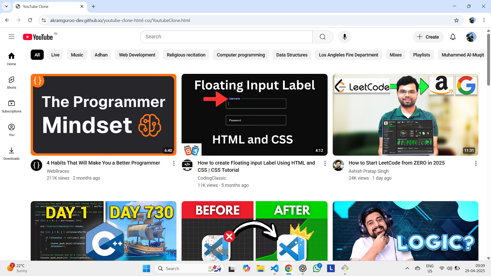

# YouTube Clone

A static clone of the YouTube homepage built using HTML and CSS.

## Features
- Fully responsive layout across laptop screen sizes.
- Clean design similar to YouTube homepage.

## Tech Stack
- HTML5
- CSS3

## Screenshots

## Live Demo
🔗 [View Project on GitHub Pages](https://akramguroo-dev.github.io/youtube-clone-html-css/)

## Author
- Akram Guroo (github.com/akramguroo-dev)
